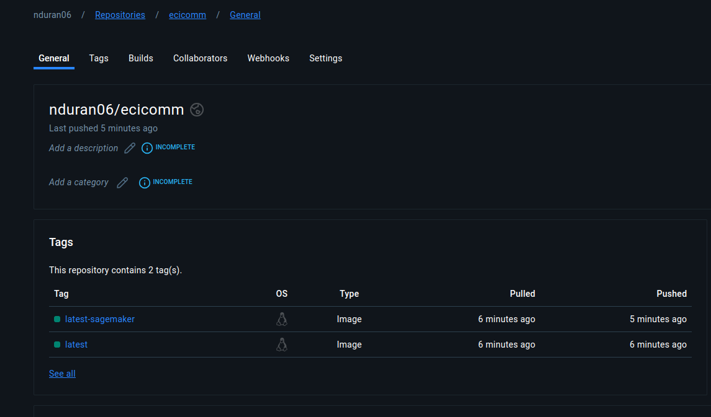
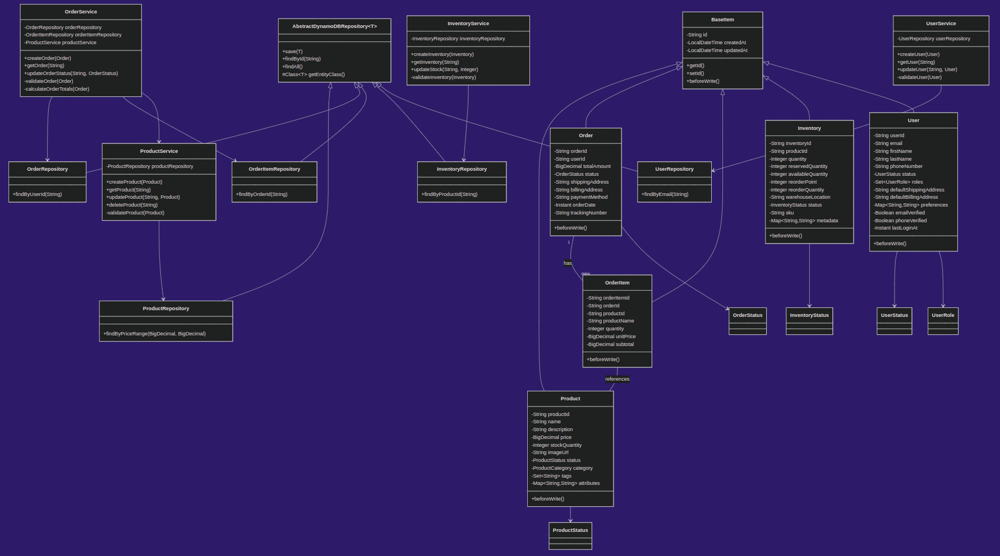
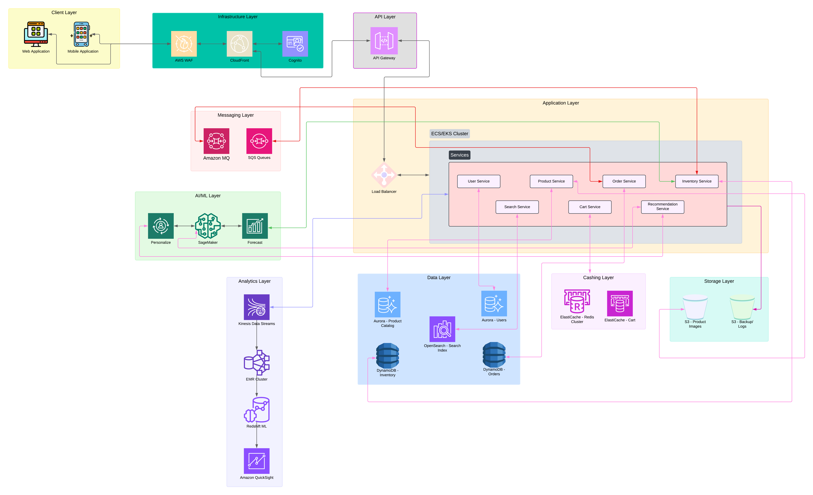

## AYGO-Project

# ECIComm

This project aims to propose the design of an architecture for one of the applications of distributed systems with integrated AI and ML capabilities, in this case, an e-commerce platform called ECIComm. The architecture follows a microservices approach, leveraging AWS services to create a scalable, resilient, and intelligent shopping experience.

### Dockerhub

In the [ECIComm Docker Hub repository](https://hub.docker.com/repository/docker/nduran06/ecicomm/general) you will find two components:

* **Tag:** latest *(Application Layer)* Services implementation - EC2
* **Tag:** latest-sagemaker *(AI/ML Layer)* Training image - Sagemaker



### Modeling



### Considerations

> The sageMaker part was done using aws-cli and cdk

> To upload the data resources to the S3 storage use [upload_to_s3.sh](sageMaker/upload_to_s3.sh), run:

```
chmod +x upload_to_s3.sh && ./upload_to_s3.sh
```

> To create the sageMaker components use [create_push_model.sh](sageMaker/sagemaker_cdk/source/create_push_model.sh), run:

```
chmod +x create_push_model.sh && ./create_push_model.sh
```

## Architecture

### Overview

The platform is designed with multiple layers, each serving specific functions while maintaining loose coupling and high cohesion. The architecture diagram (shown above) illustrates the following key layers:



## Client Layer

The Client Layer serves as the primary touchpoint for users interacting with our e-commerce platform. This layer implements sophisticated user interface patterns and optimizations to ensure a seamless shopping experience across all devices and network conditions.

### Components

1. Web Application
   The web application is built as a Single Page Application (SPA) that optimizes the user experience through efficient client-side rendering and state management. Key implementations include:

   - Dynamic Component Loading: Implements lazy loading for route-based code splitting, reducing initial bundle size and improving Time to Interactive (TTI)
   - State Management: Uses advanced state management patterns with optimistic updates for cart operations
   - Progressive Enhancement: Implements service workers for offline capabilities and push notifications
   - Performance Optimization: Implements resource hints (preload, prefetch) and modern image formats (WebP, AVIF) with fallbacks
   - Analytics Integration: Implements comprehensive user behavior tracking and performance monitoring

2. Mobile Application
   Native mobile applications leverage platform-specific capabilities while maintaining consistency with the web experience:

   - Native Features: Deep integration with device capabilities (camera for AR product visualization, biometric authentication)
   - Offline First: Implements sophisticated data synchronization with conflict resolution
   - Push Notifications: Advanced notification management with user preference controls
   - Performance Optimization: Implements image caching, progressive loading, and background data prefetching
   - Cross-Platform Sharing: Common business logic layer shared between platforms using appropriate abstraction

3. CloudFront Distribution
   The CDN layer implements advanced caching and optimization strategies:

   - Cache Management: Implements cache hierarchies with varying TTLs based on content type
   - Dynamic Content: Uses Lambda@Edge for dynamic content optimization
   - Security: Implements sophisticated WAF rules and DDoS protection
   - Performance: Utilizes HTTP/3 and QUIC protocols for improved performance
   - Analytics: Detailed edge performance monitoring and optimization

### Functions with Implementation Details

1. User Interface Management
   Implements sophisticated UI patterns:
   ```javascript
   // Example of optimistic UI update pattern
   async function addToCart(product) {
     // Immediate UI update
     updateUIState({
       cart: [...currentCart, product],
       loading: true
     });

     try {
       // Backend synchronization
       await api.cart.add(product);
     } catch (error) {
       // Rollback UI state if failed
       revertUIState();
       handleError(error);
     }
   }
   ```

2. Client-Side State Management
   Implements sophisticated caching and state synchronization:
   ```javascript
   class StateManager {
     constructor() {
       this.cache = new LRUCache({
         max: 500,
         maxAge: 1000 * 60 * 15 // 15 minutes
       });
       this.syncQueue = new PriorityQueue();
     }

     async synchronize() {
       // Implement background sync logic
     }
   }
   ```

3. Responsive Design Implementation
   Advanced responsive design patterns:
   ```css
   /* Example of container queries for advanced responsive design */
   @container card (min-width: 300px) {
     .product-image {
       aspect-ratio: 16/9;
       width: 100%;
     }
   }
   ```

## API Layer

The API Layer implements sophisticated request handling and security patterns, serving as the secure gateway to our microservices architecture.

### Components in Detail

1. API Gateway
   Implements advanced request handling and transformation:

   - Request Routing: Sophisticated routing based on content type, client capabilities, and load conditions
   - Transformation: Complex request/response transformation with schema validation
   - Caching: Multi-level caching strategy with cache coherence protocols
   - Rate Limiting: Advanced rate limiting with client classification and dynamic thresholds
   - Version Management: Sophisticated API versioning with deprecation management

   Example configuration:
   ```yaml
   apiGateway:
     routes:
       product:
         patterns:
           - /v1/products/{id}
           - /v2/products/{id}
         transforms:
           request:
             - validateSchema
             - enrichHeaders
           response:
             - sanitize
             - compress
         rateLimit:
           burstLimit: 1000
           rateLimit: 10000
           clientClassification:
             premium:
               multiplier: 2.0
             standard:
               multiplier: 1.0
   ```

2. WAF Configuration
   Implements sophisticated security rules:
   ```json
   {
     "Rules": [
       {
         "Name": "PreventSQLInjection",
         "Priority": 1,
         "Statement": {
           "SqlInjectionMatchStatement": {
             "FieldToMatch": {
               "QueryString": {}
             },
             "TextTransformation": [
               {
                 "Priority": 1,
                 "Type": "URL_DECODE"
               },
               {
                 "Priority": 2,
                 "Type": "HTML_ENTITY_DECODE"
               }
             ]
           }
         }
       }
     ]
   }
   ```

## Application Layer

The Application Layer implements our microservices architecture, with each service running in containerized environments managed by ECS/EKS. Each microservice is designed following Domain-Driven Design principles and implements specific bounded contexts of our e-commerce domain.

### Load Balancer Implementation

Our Application Load Balancer (ALB) implementation includes sophisticated routing and health checking mechanisms:

```yaml
# ALB Configuration
alb:
  listeners:
    http:
      port: 80
      protocol: HTTP
      default_action: redirect_https
    https:
      port: 443
      protocol: HTTPS
      ssl_policy: ELBSecurityPolicy-TLS-1-2-2017-01
      certificates:
        - arn:aws:acm:region:account:certificate/certificate-id

  target_groups:
    product_service:
      protocol: HTTP
      port: 8080
      health_check:
        path: /health
        interval: 30
        timeout: 5
        healthy_threshold: 2
        unhealthy_threshold: 3
      stickiness:
        enabled: true
        type: lb_cookie
        duration: 86400
```

### Container Orchestration

Our ECS/EKS configuration implements sophisticated deployment and scaling strategies:

```yaml
# ECS Service Definition
service:
  name: product-service
  cluster: ecommerce-cluster
  task_definition: product-service:latest
  desired_count: 3
  deployment_configuration:
    maximum_percent: 200
    minimum_healthy_percent: 100
  deployment_controller:
    type: ECS
  network_configuration:
    awsvpc_configuration:
      subnets:
        - subnet-12345678
        - subnet-87654321
      security_groups:
        - sg-12345678
      assign_public_ip: DISABLED
  service_registries:
    registry_arn: arn:aws:servicediscovery:region:account:service/srv-12345678
  load_balancers:
    - target_group_arn: arn:aws:elasticloadbalancing:region:account:targetgroup/product-service/12345678
      container_name: product-service
      container_port: 8080
```

### Microservices Implementation

Let's examine each microservice in detail:

#### 1. Product Service

The Product Service manages the product catalog and implements sophisticated caching strategies:

```java
@Service
public class ProductService {
    private final ProductRepository repository;
    private final RedisTemplate<String, Product> redisTemplate;
    private final S3Client s3Client;
    private final EventBridge eventBridge;

    @Transactional
    public Product createProduct(ProductCreateRequest request) {
        // Validate product data
        validateProduct(request);

        // Create product entity
        Product product = new Product();
        product.setName(request.getName());
        product.setSku(generateUniqueSku());

        // Handle image upload
        if (request.getImages() != null) {
            List<String> imageUrls = uploadProductImages(request.getImages());
            product.setImageUrls(imageUrls);
        }

        // Save to database
        product = repository.save(product);

        // Cache the product
        cacheProduct(product);

        // Publish product created event
        publishProductEvent(product, "PRODUCT_CREATED");

        return product;
    }

    private void validateProduct(ProductCreateRequest request) {
        // Implement complex validation rules
        if (!isValidCategory(request.getCategory())) {
            throw new InvalidCategoryException();
        }

        if (!isPriceValid(request.getPrice())) {
            throw new InvalidPriceException();
        }

        // Check for duplicate SKU
        if (isDuplicateSku(request.getSku())) {
            throw new DuplicateSkuException();
        }
    }

    private List<String> uploadProductImages(List<MultipartFile> images) {
        return images.stream()
            .map(this::uploadImage)
            .collect(Collectors.toList());
    }

    private String uploadImage(MultipartFile image) {
        String key = generateImageKey(image);
        PutObjectRequest request = PutObjectRequest.builder()
            .bucket(productImageBucket)
            .key(key)
            .build();

        s3Client.putObject(request,
            RequestBody.fromInputStream(image.getInputStream(),
            image.getSize()));

        return generateImageUrl(key);
    }

    private void cacheProduct(Product product) {
        String cacheKey = "product:" + product.getId();
        redisTemplate.opsForValue().set(cacheKey, product, 1, TimeUnit.HOURS);
    }

    private void publishProductEvent(Product product, String eventType) {
        PutEventsRequest request = PutEventsRequest.builder()
            .entries(Entry.builder()
                .source("product-service")
                .detailType(eventType)
                .detail(objectMapper.writeValueAsString(product))
                .eventBusName("ecommerce-events")
                .build())
            .build();

        eventBridge.putEvents(request);
    }
}
```

#### 2. Order Service

The Order Service implements the Saga pattern for distributed transactions:

```java
@Service
public class OrderService {
    private final OrderRepository orderRepository;
    private final SagaOrchestrator sagaOrchestrator;
    private final PaymentClient paymentClient;
    private final InventoryClient inventoryClient;
    private final NotificationClient notificationClient;

    @Transactional
    public Order createOrder(OrderCreateRequest request) {
        // Start saga transaction
        OrderSaga saga = sagaOrchestrator.createSaga();

        try {
            // Create order in PENDING state
            Order order = createInitialOrder(request);

            // Reserve inventory
            saga.addStep(
                () -> inventoryClient.reserveInventory(order),
                () -> inventoryClient.releaseInventory(order)
            );

            // Process payment
            saga.addStep(
                () -> paymentClient.processPayment(order),
                () -> paymentClient.refundPayment(order)
            );

            // Confirm order
            saga.addStep(
                () -> confirmOrder(order),
                () -> cancelOrder(order)
            );

            // Execute saga
            saga.execute();

            // Send confirmation
            notificationClient.sendOrderConfirmation(order);

            return order;

        } catch (Exception e) {
            // Compensate failed transaction
            saga.compensate();
            throw new OrderCreationException("Failed to create order", e);
        }
    }

    private Order createInitialOrder(OrderCreateRequest request) {
        Order order = new Order();
        order.setStatus(OrderStatus.PENDING);
        order.setItems(request.getItems());
        order.setShippingAddress(request.getShippingAddress());

        // Calculate order totals
        OrderPricing pricing = calculateOrderPricing(order);
        order.setSubtotal(pricing.getSubtotal());
        order.setTax(pricing.getTax());
        order.setShipping(pricing.getShipping());
        order.setTotal(pricing.getTotal());

        return orderRepository.save(order);
    }

    private OrderPricing calculateOrderPricing(Order order) {
        OrderPricing pricing = new OrderPricing();

        // Calculate subtotal
        BigDecimal subtotal = order.getItems().stream()
            .map(item -> item.getPrice().multiply(BigDecimal.valueOf(item.getQuantity())))
            .reduce(BigDecimal.ZERO, BigDecimal::add);

        pricing.setSubtotal(subtotal);

        // Calculate tax
        TaxCalculator taxCalculator = getTaxCalculator(order.getShippingAddress());
        pricing.setTax(taxCalculator.calculateTax(subtotal));

        // Calculate shipping
        ShippingCalculator shippingCalculator = getShippingCalculator(order);
        pricing.setShipping(shippingCalculator.calculateShipping(order));

        // Calculate total
        pricing.setTotal(subtotal.add(pricing.getTax()).add(pricing.getShipping()));

        return pricing;
    }
}
```

#### 3. Inventory Service

The Inventory Service manages stock levels and implements real-time inventory tracking with sophisticated reservation systems:

```java
@Service
public class InventoryService {
    private final DynamoDBMapper dynamoDBMapper;
    private final KinesisClient kinesisClient;
    private final EventBridge eventBridge;
    private final RedisTemplate<String, InventoryLock> lockTemplate;

    @Transactional
    public InventoryReservation reserveInventory(List<OrderItem> items) {
        // Create optimistic locks for all items
        Map<String, InventoryLock> locks = createInventoryLocks(items);

        try {
            // Validate all inventory levels
            validateInventoryLevels(items, locks);

            // Create reservations
            InventoryReservation reservation = createReservation(items);

            // Update inventory levels
            updateInventoryLevels(items);

            // Publish inventory events
            publishInventoryEvents(items);

            return reservation;

        } finally {
            // Release locks
            releaseLocks(locks);
        }
    }

    private Map<String, InventoryLock> createInventoryLocks(List<OrderItem> items) {
        Map<String, InventoryLock> locks = new HashMap<>();

        for (OrderItem item : items) {
            String lockKey = "inventory-lock:" + item.getProductId();
            InventoryLock lock = new InventoryLock(item.getProductId());

            Boolean acquired = lockTemplate.opsForValue()
                .setIfAbsent(lockKey, lock, 30, TimeUnit.SECONDS);

            if (!acquired) {
                // Release any acquired locks and throw exception
                locks.values().forEach(this::releaseLock);
                throw new InventoryLockException("Failed to acquire lock for product: " + item.getProductId());
            }

            locks.put(item.getProductId(), lock);
        }

        return locks;
    }

    private void validateInventoryLevels(List<OrderItem> items, Map<String, InventoryLock> locks) {
        List<GetItemRequest> requests = items.stream()
            .map(item -> GetItemRequest.builder()
                .tableName("inventory")
                .key(Map.of("product_id", AttributeValue.builder().s(item.getProductId()).build()))
                .build())
            .collect(Collectors.toList());

        List<GetItemResponse> responses = requests.stream()
            .map(dynamoDBClient::getItem)
            .collect(Collectors.toList());

        for (int i = 0; i < items.size(); i++) {
            OrderItem item = items.get(i);
            GetItemResponse response = responses.get(i);

            int availableQuantity = Integer.parseInt(response.item().get("quantity").n());
            if (availableQuantity < item.getQuantity()) {
                throw new InsufficientInventoryException(
                    "Insufficient inventory for product: " + item.getProductId());
            }
        }
    }

    private InventoryReservation createReservation(List<OrderItem> items) {
        InventoryReservation reservation = new InventoryReservation();
        reservation.setId(UUID.randomUUID().toString());
        reservation.setItems(items);
        reservation.setStatus(ReservationStatus.PENDING);
        reservation.setExpirationTime(LocalDateTime.now().plusMinutes(30));

        // Save reservation
        dynamoDBMapper.save(reservation);

        return reservation;
    }

    private void updateInventoryLevels(List<OrderItem> items) {
        List<TransactWriteItem> writeItems = items.stream()
            .map(item -> TransactWriteItem.builder()
                .update(Update.builder()
                    .tableName("inventory")
                    .key(Map.of("product_id",
                        AttributeValue.builder().s(item.getProductId()).build()))
                    .updateExpression("SET quantity = quantity - :quantity")
                    .expressionAttributeValues(Map.of(":quantity",
                        AttributeValue.builder().n(String.valueOf(item.getQuantity())).build()))
                    .build())
                .build())
            .collect(Collectors.toList());

        TransactWriteItemsRequest request = TransactWriteItemsRequest.builder()
            .transactItems(writeItems)
            .build();

        try {
            dynamoDBClient.transactWriteItems(request);
        } catch (TransactionCanceledException e) {
            throw new InventoryUpdateException("Failed to update inventory levels", e);
        }
    }

    private void publishInventoryEvents(List<OrderItem> items) {
        PutRecordRequest request = PutRecordRequest.builder()
            .streamName("inventory-events")
            .partitionKey("inventory-update")
            .data(SdkBytes.fromByteArray(
                objectMapper.writeValueAsBytes(
                    new InventoryUpdateEvent(items))))
            .build();

        kinesisClient.putRecord(request);
    }
}

#### 4. Search Service

The Search Service provides advanced search capabilities using OpenSearch with sophisticated indexing and query optimization:

```java
@Service
public class SearchService {
    private final RestHighLevelClient openSearchClient;
    private final ProductService productService;
    private final MetricsService metricsService;

    public SearchResult search(SearchRequest request) {
        // Build search query
        SearchSourceBuilder sourceBuilder = new SearchSourceBuilder()
            .query(buildSearchQuery(request))
            .aggregations(buildAggregations(request))
            .from(request.getOffset())
            .size(request.getLimit())
            .sort(buildSortCriteria(request));

        // Execute search
        SearchResponse response = openSearchClient.search(
            new org.elasticsearch.action.search.SearchRequest("products")
                .source(sourceBuilder),
            RequestOptions.DEFAULT
        );

        // Record search metrics
        recordSearchMetrics(request, response);

        // Process and return results
        return processSearchResponse(response);
    }

    private QueryBuilder buildSearchQuery(SearchRequest request) {
        BoolQueryBuilder queryBuilder = QueryBuilders.boolQuery();

        // Add text search
        if (request.getSearchTerm() != null) {
            queryBuilder.must(QueryBuilders.multiMatchQuery(request.getSearchTerm())
                .field("name", 2.0f)
                .field("description")
                .field("categories")
                .type(MultiMatchQueryBuilder.Type.BEST_FIELDS)
                .fuzziness(Fuzziness.AUTO));
        }

        // Add filters
        if (request.getCategories() != null) {
            queryBuilder.filter(QueryBuilders.termsQuery("categories", request.getCategories()));
        }

        if (request.getPriceRange() != null) {
            queryBuilder.filter(QueryBuilders.rangeQuery("price")
                .gte(request.getPriceRange().getMin())
                .lte(request.getPriceRange().getMax()));
        }

        // Add boost functions
        queryBuilder.should(QueryBuilders.functionScoreQuery()
            .add(ScoreFunctionBuilders.fieldValueFactorFunction("popularity")
                .modifier(FieldValueFactorFunction.Modifier.LOG1P)
                .factor(1.2f))
            .add(ScoreFunctionBuilders.exponentialDecayFunction("created_at", "now", "30d")
                .setDecay(0.5)));

        return queryBuilder;
    }

    private AggregationBuilder buildAggregations(SearchRequest request) {
        return AggregationBuilders.nested("aggs", "attributes")
            .subAggregation(AggregationBuilders.terms("categories")
                .field("attributes.category")
                .size(50))
            .subAggregation(AggregationBuilders.terms("brands")
                .field("attributes.brand")
                .size(50))
            .subAggregation(AggregationBuilders.stats("price_stats")
                .field("price"));
    }

    private List<SortBuilder<?>> buildSortCriteria(SearchRequest request) {
        List<SortBuilder<?>> sortBuilders = new ArrayList<>();

        if (request.getSortField() != null) {
            SortOrder sortOrder = request.getSortOrder() == SortOrder.DESC ?
                SortOrder.DESC : SortOrder.ASC;

            switch (request.getSortField()) {
                case PRICE:
                    sortBuilders.add(SortBuilders.fieldSort("price").order(sortOrder));
                    break;
                case POPULARITY:
                    sortBuilders.add(SortBuilders.fieldSort("popularity").order(sortOrder));
                    break;
                case RELEVANCE:
                    sortBuilders.add(SortBuilders.scoreSort().order(sortOrder));
                    break;
            }
        }

        return sortBuilders;
    }

    private SearchResult processSearchResponse(SearchResponse response) {
        SearchResult result = new SearchResult();

        // Process hits
        result.setTotalHits(response.getHits().getTotalHits().value);
        result.setProducts(Arrays.stream(response.getHits().getHits())
            .map(this::convertHitToProduct)
            .collect(Collectors.toList()));

        // Process aggregations
        result.setFacets(processAggregations(response.getAggregations()));

        return result;
    }

    private void recordSearchMetrics(SearchRequest request, SearchResponse response) {
        SearchMetrics metrics = new SearchMetrics();
        metrics.setQueryTime(response.getTook().getMillis());
        metrics.setTotalHits(response.getHits().getTotalHits().value);
        metrics.setSearchTerm(request.getSearchTerm());

        metricsService.recordSearchMetrics(metrics);
    }
}
```

#### 5. User Service

The User Service manages user authentication, authorization, and profile management with sophisticated security measures:

```java
@Service
public class UserService {
    private final UserRepository userRepository;
    private final PasswordEncoder passwordEncoder;
    private final JwtTokenProvider tokenProvider;
    private final CognitoIdentityClient cognitoClient;
    private final EventBridge eventBridge;
    private final AuditLogger auditLogger;

    @Transactional
    public UserRegistrationResult registerUser(UserRegistrationRequest request) {
        // Validate registration data
        validateRegistrationData(request);

        // Check for existing user
        if (userRepository.existsByEmail(request.getEmail())) {
            throw new UserAlreadyExistsException("Email already registered");
        }

        try {
            // Create Cognito user
            SignUpRequest signUpRequest = SignUpRequest.builder()
                .clientId(cognitoClientId)
                .username(request.getEmail())
                .password(request.getPassword())
                .userAttributes(
                    AttributeType.builder()
                        .name("email")
                        .value(request.getEmail())
                        .build(),
                    AttributeType.builder()
                        .name("given_name")
                        .value(request.getFirstName())
                        .build(),
                    AttributeType.builder()
                        .name("family_name")
                        .value(request.getLastName())
                        .build()
                )
                .build();

            SignUpResponse cognitoResponse = cognitoClient.signUp(signUpRequest);

            // Create local user record
            User user = new User();
            user.setEmail(request.getEmail());
            user.setFirstName(request.getFirstName());
            user.setLastName(request.getLastName());
            user.setCognitoId(cognitoResponse.userSub());
            user.setStatus(UserStatus.PENDING_CONFIRMATION);

            user = userRepository.save(user);

            // Publish user created event
            publishUserEvent(user, "USER_CREATED");

            // Audit log
            auditLogger.log(
                AuditAction.USER_REGISTRATION,
                user.getId(),
                "User registration successful"
            );

            return new UserRegistrationResult(user, cognitoResponse.userSub());

        } catch (Exception e) {
            auditLogger.log(
                AuditAction.USER_REGISTRATION_FAILED,
                null,
                "User registration failed: " + e.getMessage()
            );
            throw new RegistrationFailedException("Registration failed", e);
        }
    }

    private void validateRegistrationData(UserRegistrationRequest request) {
        PasswordValidator validator = new PasswordValidator(Arrays.asList(
            new LengthRule(8, 30),
            new CharacterRule(EnglishCharacterData.UpperCase, 1),
            new CharacterRule(EnglishCharacterData.LowerCase, 1),
            new CharacterRule(EnglishCharacterData.Digit, 1),
            new CharacterRule(EnglishCharacterData.Special, 1),
            new WhitespaceRule()
        ));

        RuleResult result = validator.validate(new PasswordData(request.getPassword()));
        if (!result.isValid()) {
            throw new InvalidPasswordException(
                "Password does not meet security requirements: " +
                validator.getMessages(result)
            );
        }

        if (!isValidEmail(request.getEmail())) {
            throw new InvalidEmailException("Invalid email format");
        }
    }

    @Transactional
    public UserProfile updateProfile(Long userId, ProfileUpdateRequest request) {
        User user = userRepository.findById(userId)
            .orElseThrow(() -> new UserNotFoundException("User not found"));

        // Update Cognito attributes
        UpdateUserAttributesRequest cognitoRequest = UpdateUserAttributesRequest.builder()
            .userAttributes(
                AttributeType.builder()
                    .name("given_name")
                    .value(request.getFirstName())
                    .build(),
                AttributeType.builder()
                    .name("family_name")
                    .value(request.getLastName())
                    .build()
            )
            .accessToken(request.getAccessToken())
            .build();

        cognitoClient.updateUserAttributes(cognitoRequest);

        // Update local record
        user.setFirstName(request.getFirstName());
        user.setLastName(request.getLastName());
        user.setPhoneNumber(request.getPhoneNumber());
        user.setPreferences(request.getPreferences());

        user = userRepository.save(user);

        // Publish profile updated event
        publishUserEvent(user, "USER_PROFILE_UPDATED");

        return new UserProfile(user);
    }

    private void publishUserEvent(User user, String eventType) {
        UserEvent event = new UserEvent(user, eventType);

        PutEventsRequest request = PutEventsRequest.builder()
            .entries(Entry.builder()
                .source("user-service")
                .detailType(eventType)
                .detail(objectMapper.writeValueAsString(event))
                .eventBusName("ecommerce-events")
                .build())
            .build();

        eventBridge.putEvents(request);
    }
}

#### 6. Cart Service

The Cart Service handles shopping cart operations with real-time synchronization and pricing calculations:

```java
@Service
public class CartService {
    private final RedisTemplate<String, ShoppingCart> cartTemplate;
    private final ProductClient productClient;
    private final PromotionEngine promotionEngine;
    private final TaxCalculator taxCalculator;
    private final MetricsService metricsService;

    public ShoppingCart getOrCreateCart(String sessionId) {
        String cartKey = "cart:" + sessionId;
        ShoppingCart cart = cartTemplate.opsForValue().get(cartKey);

        if (cart == null) {
            cart = new ShoppingCart(sessionId);
            cartTemplate.opsForValue().set(cartKey, cart, 24, TimeUnit.HOURS);
        }

        return cart;
    }

    @Transactional
    public CartUpdateResult addItem(String sessionId, CartItemRequest request) {
        ShoppingCart cart = getOrCreateCart(sessionId);

        // Validate product availability
        ProductAvailability availability = productClient.checkAvailability(
            request.getProductId(),
            request.getQuantity()
        );

        if (!availability.isAvailable()) {
            throw new ProductNotAvailableException(
                "Product not available in requested quantity"
            );
        }

        // Add or update item
        CartItem item = cart.getItems().stream()
            .filter(i -> i.getProductId().equals(request.getProductId()))
            .findFirst()
            .orElseGet(() -> {
                CartItem newItem = new CartItem(request.getProductId());
                cart.getItems().add(newItem);
                return newItem;
            });

        item.setQuantity(item.getQuantity() + request.getQuantity());

        // Recalculate cart totals
        recalculateCart(cart);

        // Save updated cart
        cartTemplate.opsForValue().set(
            "cart:" + sessionId,
            cart,
            24,
            TimeUnit.HOURS
        );

        // Record metrics
        metricsService.recordCartUpdate(cart);

        return new CartUpdateResult(cart);
    }

    private void recalculateCart(ShoppingCart cart) {
        // Get current product prices
        Map<String, ProductPrice> prices = productClient.getPrices(
            cart.getItems().stream()
                .map(CartItem::getProductId)
                .collect(Collectors.toList())
        );

        // Update item prices
        cart.getItems().forEach(item -> {
            ProductPrice price = prices.get(item.getProductId());
            item.setUnitPrice(price.getAmount());
            item.setSubtotal(price.getAmount().multiply(
                BigDecimal.valueOf(item.getQuantity()))
            );
        });

        // Calculate subtotal
        BigDecimal subtotal = cart.getItems().stream()
            .map(CartItem::getSubtotal)
            .reduce(BigDecimal.ZERO, BigDecimal::add);

        cart.setSubtotal(subtotal);

        // Apply promotions
        List<PromotionResult> promotions = promotionEngine.applyPromotions(cart);
        cart.setPromotions(promotions);

        BigDecimal discountTotal = promotions.stream()
            .map(PromotionResult::getDiscountAmount)
            .reduce(BigDecimal.ZERO, BigDecimal::add);

        cart.setDiscountTotal(discountTotal);

        // Calculate tax
        BigDecimal taxableAmount = subtotal.subtract(discountTotal);
        BigDecimal tax = taxCalculator.calculateTax(taxableAmount);
        cart.setTax(tax);

        // Calculate total
        cart.setTotal(taxableAmount.add(tax));
    }

    @Transactional
    public void mergeAnonymousCart(String anonymousSessionId, Long userId) {
        ShoppingCart anonymousCart = getOrCreateCart(anonymousSessionId);
        ShoppingCart userCart = getOrCreateCart("user:" + userId);

        // Merge items
        anonymousCart.getItems().forEach(item -> {
            CartItem existingItem = userCart.getItems().stream()
                .filter(i -> i.getProductId().equals(item.getProductId()))
                .findFirst()
                .orElse(null);

            if (existingItem != null) {
                existingItem.setQuantity(
                    existingItem.getQuantity() + item.getQuantity()
                );
            } else {
                userCart.getItems().add(item);
            }
        });

        // Recalculate merged cart
        recalculateCart(userCart);

        // Save merged cart
        cartTemplate.opsForValue().set(
            "user:" + userId,
            userCart,
            24,
            TimeUnit.HOURS
        );

        // Delete anonymous cart
        cartTemplate.delete("cart:" + anonymousSessionId);
    }
}
```

## Data Layer

## Aurora Database Implementation (Product and User Data)

Our Aurora implementation handles relational data that requires strong consistency and complex querying capabilities. Here's how we've structured it for optimal performance:

```java
@Configuration
public class AuroraConfiguration {
    @Bean
    public DataSource auroraDataSource() {
        HikariConfig config = new HikariConfig();
        config.setJdbcUrl(auroraProperties.getUrl());
        config.setUsername(auroraProperties.getUsername());
        config.setPassword(auroraProperties.getPassword());

        // Connection pool settings optimized for e-commerce workload
        config.setMaximumPoolSize(20);
        config.setMinimumIdle(5);
        config.setIdleTimeout(300000);
        config.setConnectionTimeout(20000);

        // Enable statement caching
        config.addDataSourceProperty("cachePrepStmts", "true");
        config.addDataSourceProperty("prepStmtCacheSize", "250");
        config.addDataSourceProperty("prepStmtCacheSqlLimit", "2048");

        return new HikariDataSource(config);
    }
}

@Entity
@Table(name = "products")
public class Product {
    @Id
    @GeneratedValue(strategy = GenerationType.UUID)
    private String id;

    @Column(nullable = false)
    private String name;

    @Column(length = 2000)
    private String description;

    @Column(precision = 10, scale = 2, nullable = false)
    private BigDecimal price;

    @ElementCollection
    @CollectionTable(name = "product_images")
    private List<String> imageUrls;

    @Version
    private Long version;

    @CreatedDate
    private LocalDateTime createdAt;

    @LastModifiedDate
    private LocalDateTime updatedAt;

    // Optimistic locking strategy
    @PreUpdate
    protected void onUpdate() {
        this.updatedAt = LocalDateTime.now();
    }
}

@Repository
public class ProductRepository {
    private final EntityManager entityManager;

    public List<Product> findProductsByCategory(String category, Pageable pageable) {
        String sql = """
            SELECT p FROM Product p
            WHERE p.category = :category
            AND p.status = 'ACTIVE'
            ORDER BY p.createdAt DESC
            """;

        return entityManager.createQuery(sql, Product.class)
            .setParameter("category", category)
            .setFirstResult(pageable.getPageNumber() * pageable.getPageSize())
            .setMaxResults(pageable.getPageSize())
            .setHint(QueryHints.HINT_CACHEABLE, true)
            .setHint(QueryHints.HINT_CACHE_REGION, "product_category")
            .getResultList();
    }
}
```

## DynamoDB Implementation (Orders and Inventory)

Our DynamoDB implementation is optimized for high-throughput operations with consistent performance:

```java
@Configuration
public class DynamoDBConfiguration {
    @Bean
    public DynamoDBMapper dynamoDBMapper() {
        AmazonDynamoDB client = AmazonDynamoDBClientBuilder.standard()
            .withRegion(Regions.US_EAST_1)
            .withClientConfiguration(new ClientConfiguration()
                .withClientExecutionTimeout(10000)
                .withRequestTimeout(5000))
            .build();

        return new DynamoDBMapper(client, DynamoDBMapperConfig.builder()
            .withSaveBehavior(DynamoDBMapperConfig.SaveBehavior.UPDATE_SKIP_NULL_ATTRIBUTES)
            .withConsistentReads(DynamoDBMapperConfig.ConsistentReads.EVENTUAL)
            .withTableNameOverride(null)
            .build());
    }
}

@DynamoDBTable(tableName = "orders")
public class Order {
    @DynamoDBHashKey
    private String orderId;

    @DynamoDBRangeKey
    private String userId;

    @DynamoDBAttribute
    private String status;

    @DynamoDBAttribute
    private BigDecimal total;

    @DynamoDBTypeConverted(converter = LocalDateTimeConverter.class)
    private LocalDateTime orderDate;

    @DynamoDBAttribute
    private Map<String, OrderItem> items;

    // GSI for user orders
    @DynamoDBIndexHashKey(globalSecondaryIndexName = "UserOrdersIndex")
    public String getUserOrderKey() {
        return userId + "#" + orderDate.format(DateTimeFormatter.ISO_DATE);
    }
}

public class OrderRepository {
    private final DynamoDBMapper dynamoDBMapper;

    public Order createOrder(Order order) {
        // Implement optimistic locking
        DynamoDBSaveExpression saveExpression = new DynamoDBSaveExpression()
            .withExpectedEntry("orderId",
                new ExpectedAttributeValue()
                    .withExists(false));

        try {
            dynamoDBMapper.save(order, saveExpression);
            return order;
        } catch (ConditionalCheckFailedException e) {
            throw new OrderAlreadyExistsException("Order already exists");
        }
    }

    public List<Order> findUserOrders(String userId, LocalDateTime startDate, LocalDateTime endDate) {
        Map<String, AttributeValue> eav = new HashMap<>();
        eav.put(":userId", new AttributeValue().withS(userId));
        eav.put(":startDate", new AttributeValue().withS(startDate.format(DateTimeFormatter.ISO_DATE)));
        eav.put(":endDate", new AttributeValue().withS(endDate.format(DateTimeFormatter.ISO_DATE)));

        DynamoDBQueryExpression<Order> queryExpression = new DynamoDBQueryExpression<Order>()
            .withIndexName("UserOrdersIndex")
            .withConsistentRead(false)
            .withKeyConditionExpression("userId = :userId and orderDate between :startDate and :endDate")
            .withExpressionAttributeValues(eav);

        return dynamoDBMapper.query(Order.class, queryExpression);
    }
}
```

## ElastiCache Implementation (Cart and Session Data)

Our Redis implementation through ElastiCache handles high-velocity, temporary data:

```java
@Configuration
public class RedisConfiguration {
    @Bean
    public RedisTemplate<String, Object> redisTemplate() {
        RedisTemplate<String, Object> template = new RedisTemplate<>();
        template.setConnectionFactory(lettuceConnectionFactory());

        // Configure serializers
        template.setKeySerializer(new StringRedisSerializer());
        template.setHashKeySerializer(new StringRedisSerializer());
        template.setHashValueSerializer(new JdkSerializationRedisSerializer());
        template.setValueSerializer(new JdkSerializationRedisSerializer());

        // Enable transaction support
        template.setEnableTransactionSupport(true);

        return template;
    }

    @Bean
    public LettuceConnectionFactory lettuceConnectionFactory() {
        LettuceClientConfiguration clientConfig = LettuceClientConfiguration.builder()
            .commandTimeout(Duration.ofMillis(500))
            .shutdownTimeout(Duration.ofSeconds(1))
            .build();

        RedisStandaloneConfiguration serverConfig = new RedisStandaloneConfiguration();
        serverConfig.setHostName(redisProperties.getHost());
        serverConfig.setPort(redisProperties.getPort());

        return new LettuceConnectionFactory(serverConfig, clientConfig);
    }
}

@Service
public class CartService {
    private final RedisTemplate<String, ShoppingCart> cartTemplate;

    public ShoppingCart getCart(String sessionId) {
        String cartKey = "cart:" + sessionId;
        ShoppingCart cart = cartTemplate.opsForValue().get(cartKey);

        if (cart == null) {
            cart = new ShoppingCart();
            // Set expiration for cart data
            cartTemplate.opsForValue().set(cartKey, cart, Duration.ofHours(24));
        }

        return cart;
    }

    public void updateCart(String sessionId, ShoppingCart cart) {
        cartTemplate.execute(new SessionCallback<List<Object>>() {
            @Override
            public List<Object> execute(RedisOperations operations) throws DataAccessException {
                operations.multi();

                String cartKey = "cart:" + sessionId;
                operations.opsForValue().set(cartKey, cart);
                operations.expire(cartKey, Duration.ofHours(24));

                return operations.exec();
            }
        });
    }
}
```

## OpenSearch Implementation (Search Functionality)

Our OpenSearch implementation provides powerful search capabilities:

```java
@Configuration
public class OpenSearchConfiguration {
    @Bean
    public RestHighLevelClient openSearchClient() {
        return new RestHighLevelClient(
            RestClient.builder(new HttpHost(
                openSearchProperties.getHost(),
                openSearchProperties.getPort(),
                "https"
            ))
            .setRequestConfigCallback(requestConfigBuilder ->
                requestConfigBuilder
                    .setConnectTimeout(5000)
                    .setSocketTimeout(60000))
            .setHttpClientConfigCallback(httpClientBuilder ->
                httpClientBuilder
                    .setDefaultIOReactorConfig(IOReactorConfig.custom()
                        .setIoThreadCount(4)
                        .setSoKeepAlive(true)
                        .build()))
        );
    }
}

@Service
public class SearchService {
    private final RestHighLevelClient client;

    public SearchResponse searchProducts(SearchRequest request) {
        BoolQueryBuilder queryBuilder = QueryBuilders.boolQuery();

        // Add full-text search
        if (request.getSearchTerm() != null) {
            queryBuilder.must(QueryBuilders.multiMatchQuery(request.getSearchTerm())
                .field("name", 2.0f)
                .field("description")
                .type(MultiMatchQueryBuilder.Type.BEST_FIELDS)
                .fuzziness(Fuzziness.AUTO));
        }

        // Add filters
        if (request.getCategory() != null) {
            queryBuilder.filter(QueryBuilders.termQuery("category", request.getCategory()));
        }

        if (request.getPriceRange() != null) {
            queryBuilder.filter(QueryBuilders.rangeQuery("price")
                .gte(request.getPriceRange().getMin())
                .lte(request.getPriceRange().getMax()));
        }

        // Add sorting
        SearchSourceBuilder sourceBuilder = new SearchSourceBuilder()
            .query(queryBuilder)
            .from(request.getOffset())
            .size(request.getLimit())
            .sort(getSortBuilder(request.getSortBy()));

        // Execute search
        return client.search(
            new org.elasticsearch.action.search.SearchRequest("products")
                .source(sourceBuilder),
            RequestOptions.DEFAULT
        );
    }
}
```

This implementation provides robust data persistence with optimized performance for each type of data and access pattern in our e-commerce platform. Each database choice is specifically tailored to its use case:

- Aurora provides ACID compliance for critical business data
- DynamoDB offers consistent performance for high-throughput operations
- ElastiCache enables fast access to temporary and frequently accessed data
- OpenSearch powers our advanced search capabilities

## Storage Layer

Our storage layer handles large-scale binary data storage and management through Amazon S3. We've organized this layer into distinct components that serve different purposes while maintaining high performance and reliability.

## Product Images Storage Implementation

The product images component manages all product-related visual assets. Here's how we've implemented this crucial part of our storage system:

```java
@Service
public class ProductImageService {
    private final AmazonS3 s3Client;
    private final ImageProcessor imageProcessor;
    private final CloudFront cloudFront;

    @Value("${aws.s3.product-images-bucket}")
    private String productImagesBucket;

    @Value("${aws.cloudfront.domain}")
    private String cloudfrontDomain;

    public ImageUploadResult uploadProductImage(MultipartFile file, String productId) {
        // First, validate the image
        validateImage(file);

        // Generate different sizes of the image for different use cases
        Map<ImageSize, byte[]> processedImages = imageProcessor.processImage(
            file.getInputStream(),
            Arrays.asList(
                new ImageSize(800, 800, "large"),
                new ImageSize(400, 400, "medium"),
                new ImageSize(200, 200, "thumbnail")
            )
        );

        // Upload each size to S3 with appropriate metadata
        List<String> uploadedUrls = new ArrayList<>();

        for (Map.Entry<ImageSize, byte[]> entry : processedImages.entrySet()) {
            String key = generateImageKey(productId, entry.getKey());

            // Prepare object metadata
            ObjectMetadata metadata = new ObjectMetadata();
            metadata.setContentType(file.getContentType());
            metadata.setContentLength(entry.getValue().length);
            metadata.addUserMetadata("product-id", productId);
            metadata.addUserMetadata("size", entry.getKey().getName());

            // Add cache control headers for CloudFront
            metadata.setCacheControl("public, max-age=31536000");

            // Upload to S3 with server-side encryption
            PutObjectRequest putRequest = new PutObjectRequest(
                productImagesBucket,
                key,
                new ByteArrayInputStream(entry.getValue()),
                metadata
            ).withServerSideEncryption(ServerSideEncryption.AES256);

            s3Client.putObject(putRequest);

            // Generate CloudFront URL
            String cdnUrl = String.format("https://%s/%s", cloudfrontDomain, key);
            uploadedUrls.add(cdnUrl);
        }

        return new ImageUploadResult(uploadedUrls);
    }

    private void validateImage(MultipartFile file) {
        // Check file size
        if (file.getSize() > 5_000_000) { // 5MB limit
            throw new ImageValidationException("Image size exceeds 5MB limit");
        }

        // Verify file type
        String contentType = file.getContentType();
        if (!Arrays.asList("image/jpeg", "image/png", "image/webp")
                .contains(contentType)) {
            throw new ImageValidationException("Unsupported image format");
        }

        // Validate image dimensions
        try {
            BufferedImage img = ImageIO.read(file.getInputStream());
            if (img.getWidth() < 800 || img.getHeight() < 800) {
                throw new ImageValidationException(
                    "Image dimensions must be at least 800x800 pixels");
            }
        } catch (IOException e) {
            throw new ImageProcessingException("Failed to process image", e);
        }
    }

    private String generateImageKey(String productId, ImageSize size) {
        return String.format(
            "products/%s/images/%s_%s.%s",
            productId,
            UUID.randomUUID().toString(),
            size.getName(),
            "webp"  // We convert all images to WebP format
        );
    }
}
```

## System Logs and Audit Trail Implementation

Our logging system captures detailed information about system operations and user activities:

```java
@Service
public class LoggingService {
    private final AmazonS3 s3Client;
    private final KinesisClient kinesisClient;

    @Value("${aws.s3.logs-bucket}")
    private String logsBucket;

    @Value("${aws.kinesis.stream-name}")
    private String streamName;

    public void logSystemEvent(SystemEvent event) {
        // First, send to Kinesis for real-time processing
        sendToKinesis(event);

        // Then, archive to S3
        archiveToS3(event);
    }

    private void sendToKinesis(SystemEvent event) {
        PutRecordRequest request = PutRecordRequest.builder()
            .streamName(streamName)
            .partitionKey(event.getSource())
            .data(SdkBytes.fromByteArray(
                objectMapper.writeValueAsBytes(event)))
            .build();

        kinesisClient.putRecord(request);
    }

    private void archiveToS3(SystemEvent event) {
        String key = generateLogKey(event);

        ObjectMetadata metadata = new ObjectMetadata();
        metadata.addUserMetadata("event-type", event.getType());
        metadata.addUserMetadata("source", event.getSource());
        metadata.addUserMetadata("timestamp",
            event.getTimestamp().toString());

        PutObjectRequest putRequest = new PutObjectRequest(
            logsBucket,
            key,
            new ByteArrayInputStream(
                objectMapper.writeValueAsBytes(event)),
            metadata
        );

        s3Client.putObject(putRequest);
    }

    private String generateLogKey(SystemEvent event) {
        LocalDateTime timestamp = event.getTimestamp();
        return String.format(
            "logs/%d/%02d/%02d/%s_%s.json",
            timestamp.getYear(),
            timestamp.getMonthValue(),
            timestamp.getDayOfMonth(),
            event.getType(),
            UUID.randomUUID().toString()
        );
    }
}
```

## Backup Management Implementation

Our backup system ensures data durability and enables disaster recovery:

```java
@Service
public class BackupService {
    private final AmazonS3 s3Client;
    private final AuroraClient auroraClient;
    private final DynamoDBClient dynamoDBClient;
    private final SNSClient snsClient;

    @Value("${aws.s3.backup-bucket}")
    private String backupBucket;

    @Value("${aws.sns.backup-topic}")
    private String backupTopic;

    @Scheduled(cron = "0 0 1 * * ?")  // Run at 1 AM daily
    public void performDailyBackup() {
        try {
            // Start Aurora snapshot
            String snapshotId = initiateAuroraSnapshot();

            // Create DynamoDB backup
            String backupId = createDynamoDBBackup();

            // Export OpenSearch indices
            String exportId = exportOpenSearchIndices();

            // Monitor backup progress
            CompletableFuture.allOf(
                monitorAuroraSnapshot(snapshotId),
                monitorDynamoDBBackup(backupId),
                monitorOpenSearchExport(exportId)
            ).thenAccept(v -> {
                // Notify success
                notifyBackupComplete(Arrays.asList(
                    snapshotId, backupId, exportId));
            });

        } catch (Exception e) {
            // Notify failure
            notifyBackupFailure(e);
        }
    }

    private void notifyBackupComplete(List<String> backupIds) {
        PublishRequest request = PublishRequest.builder()
            .topicArn(backupTopic)
            .subject("Daily Backup Completed Successfully")
            .message(createSuccessMessage(backupIds))
            .build();

        snsClient.publish(request);
    }

    private void notifyBackupFailure(Exception e) {
        PublishRequest request = PublishRequest.builder()
            .topicArn(backupTopic)
            .subject("Daily Backup Failed")
            .message(createFailureMessage(e))
            .build();

        snsClient.publish(request);
    }
}
```

## Archive Management Implementation

Our archiving system handles long-term storage of historical data:

```java
@Service
public class ArchiveService {
    private final AmazonS3 s3Client;
    private final GlacierClient glacierClient;

    @Value("${aws.s3.archive-bucket}")
    private String archiveBucket;

    @Value("${aws.glacier.vault-name}")
    private String glacierVault;

    public void archiveOldOrders(LocalDate cutoffDate) {
        // Query old orders
        List<Order> oldOrders = orderRepository
            .findOrdersBeforeDate(cutoffDate);

        // Batch process orders
        List<List<Order>> batches = Lists.partition(oldOrders, 1000);

        for (List<Order> batch : batches) {
            // Create archive file
            byte[] archiveData = createArchiveFile(batch);

            // Upload to Glacier
            UploadArchiveRequest request = UploadArchiveRequest.builder()
                .vaultName(glacierVault)
                .body(RequestBody.fromBytes(archiveData))
                .checksum(calculateChecksum(archiveData))
                .build();

            UploadArchiveResponse response =
                glacierClient.uploadArchive(request);

            // Store archive metadata
            storeArchiveMetadata(batch, response.archiveId());

            // Delete archived orders from active storage
            orderRepository.deleteAll(batch);
        }
    }

    private byte[] createArchiveFile(List<Order> orders) {
        // Implement archive file creation with compression
        try (ByteArrayOutputStream baos = new ByteArrayOutputStream();
             GZIPOutputStream gzipOutputStream = new GZIPOutputStream(baos)) {

            objectMapper.writeValue(gzipOutputStream, orders);
            return baos.toByteArray();
        }
    }

    private void storeArchiveMetadata(List<Order> orders, String archiveId) {
        ArchiveMetadata metadata = new ArchiveMetadata();
        metadata.setArchiveId(archiveId);
        metadata.setOrderIds(orders.stream()
            .map(Order::getId)
            .collect(Collectors.toList()));
        metadata.setArchiveDate(LocalDateTime.now());

        archiveMetadataRepository.save(metadata);
    }
}
```

These implementations provide a robust foundation for managing various types of data storage in our e-commerce platform. Each component is designed with specific requirements in mind:

* The Product Images Storage handles high-throughput image processing and delivery, implementing sophisticated caching strategies through CloudFront.

* The System Logs implementation provides a comprehensive audit trail while ensuring efficient storage and retrieval of log data.

* The Backup Management system ensures data durability through automated, consistent backup procedures across all our data stores.

* The Archive Management system helps maintain system performance by moving historical data to cold storage while maintaining accessibility when needed.

## Analytics Layer

Our analytics layer processes vast amounts of e-commerce data to provide actionable business insights. This implementation combines real-time processing with batch analytics to deliver a comprehensive view of our platform's performance and user behavior.

## Real-Time Analytics Implementation

The real-time analytics pipeline captures and processes events as they happen, providing immediate insights into platform activity:

```java
@Service
public class RealTimeAnalyticsService {
    private final KinesisClient kinesisClient;
    private final ElasticsearchClient elasticsearchClient;
    private final RedisTemplate<String, String> redisTemplate;

    @Value("${aws.kinesis.stream-name}")
    private String streamName;

    public void processUserEvent(UserEvent event) {
        // Transform event data for analytics
        AnalyticsEvent analyticsEvent = transformEvent(event);

        // Send to Kinesis stream for real-time processing
        PutRecordRequest request = PutRecordRequest.builder()
            .streamName(streamName)
            .partitionKey(event.getUserId())
            .data(SdkBytes.fromByteArray(
                objectMapper.writeValueAsBytes(analyticsEvent)))
            .build();

        kinesisClient.putRecord(request);

        // Update real-time metrics
        updateRealTimeMetrics(analyticsEvent);
    }

    private void updateRealTimeMetrics(AnalyticsEvent event) {
        String dateHour = LocalDateTime.now().format(
            DateTimeFormatter.ofPattern("yyyy-MM-dd:HH"));

        // Update hourly metrics using Redis
        switch (event.getType()) {
            case PAGE_VIEW:
                redisTemplate.opsForHash().increment(
                    "metrics:" + dateHour,
                    "pageviews",
                    1
                );
                break;

            case PRODUCT_VIEW:
                redisTemplate.opsForHash().increment(
                    "metrics:" + dateHour,
                    "product_views:" + event.getProductId(),
                    1
                );
                break;

            case ADD_TO_CART:
                redisTemplate.opsForHash().increment(
                    "metrics:" + dateHour,
                    "add_to_cart",
                    1
                );
                break;

            case PURCHASE:
                redisTemplate.opsForHash().increment(
                    "metrics:" + dateHour,
                    "purchases",
                    1
                );
                redisTemplate.opsForHash().increment(
                    "metrics:" + dateHour,
                    "revenue",
                    event.getOrderValue().longValue()
                );
                break;
        }
    }
}
```

## Kinesis Data Processing Implementation

Our Kinesis implementation processes streaming data for real-time analytics:

```java
@Service
public class KinesisProcessorService {
    private final AmazonKinesis kinesisClient;
    private final DynamoDBMapper dynamoDBMapper;
    private final ElasticsearchClient elasticsearchClient;

    @KinesisListener(stream = "ecommerce-events")
    public void processRecord(Record record) {
        try {
            // Deserialize the event
            AnalyticsEvent event = objectMapper.readValue(
                record.getData().array(),
                AnalyticsEvent.class
            );

            // Process based on event type
            switch (event.getType()) {
                case USER_BEHAVIOR:
                    processUserBehavior(event);
                    break;

                case SALES:
                    processSalesEvent(event);
                    break;

                case INVENTORY:
                    processInventoryEvent(event);
                    break;
            }

            // Update real-time dashboards
            updateDashboards(event);

        } catch (Exception e) {
            // Handle failed records
            handleFailedRecord(record, e);
        }
    }

    private void processUserBehavior(AnalyticsEvent event) {
        // Analyze user session
        UserSession session = analyzeUserSession(event);

        // Update user behavior metrics
        updateUserMetrics(session);

        // Store for machine learning processing
        storeBehaviorData(session);
    }

    private void processSalesEvent(AnalyticsEvent event) {
        // Calculate revenue metrics
        SalesMetrics metrics = calculateSalesMetrics(event);

        // Update real-time sales dashboard
        updateSalesDashboard(metrics);

        // Store for historical analysis
        storeSalesData(metrics);
    }
}
```

## Data Warehouse Implementation

Our data warehouse implementation using Redshift handles historical data analysis:

```java
@Service
public class DataWarehouseService {
    private final JdbcTemplate redshiftJdbcTemplate;
    private final S3Client s3Client;

    @Value("${aws.s3.analytics-bucket}")
    private String analyticsBucket;

    @Scheduled(cron = "0 0 * * * *") // Run hourly
    public void loadIncrementalData() {
        // Generate COPY commands for different data types
        String[] copyCommands = {
            generateCopyCommand("sales_facts"),
            generateCopyCommand("user_behavior"),
            generateCopyCommand("inventory_snapshots")
        };

        // Execute COPY commands
        for (String copyCommand : copyCommands) {
            redshiftJdbcTemplate.execute(copyCommand);
        }

        // Refresh materialized views
        refreshMaterializedViews();
    }

    private String generateCopyCommand(String tableName) {
        return String.format(
            """
            COPY %s
            FROM 's3://%s/stage/%s/'
            IAM_ROLE 'arn:aws:iam::account:role/redshift-loader'
            JSON 'auto'
            TIMEFORMAT 'auto'
            TRUNCATECOLUMNS
            COMPUPDATE OFF
            """,
            tableName,
            analyticsBucket,
            tableName
        );
    }

    private void refreshMaterializedViews() {
        // Refresh key materialized views for faster querying
        List<String> views = Arrays.asList(
            "daily_sales_summary",
            "product_performance_metrics",
            "customer_behavior_analysis",
            "inventory_turnover_metrics"
        );

        for (String view : views) {
            redshiftJdbcTemplate.execute(
                "REFRESH MATERIALIZED VIEW " + view);
        }
    }
}
```

## Analytics API Implementation

Our Analytics API provides access to processed data and insights:

```java
@RestController
@RequestMapping("/api/v1/analytics")
public class AnalyticsController {
    private final AnalyticsService analyticsService;
    private final CacheManager cacheManager;

    @GetMapping("/dashboard/summary")
    public DashboardSummary getDashboardSummary(
            @RequestParam LocalDate startDate,
            @RequestParam LocalDate endDate) {

        String cacheKey = String.format(
            "dashboard:%s:%s",
            startDate,
            endDate
        );

        return cacheManager.getOrCompute(
            cacheKey,
            () -> analyticsService.generateDashboardSummary(
                startDate,
                endDate
            ),
            Duration.ofMinutes(15)
        );
    }

    @GetMapping("/reports/sales")
    public SalesReport generateSalesReport(
            @RequestParam LocalDate startDate,
            @RequestParam LocalDate endDate,
            @RequestParam(required = false) String dimension) {

        return analyticsService.generateSalesReport(
            startDate,
            endDate,
            dimension
        );
    }

    @GetMapping("/insights/recommendations")
    public List<BusinessInsight> getBusinessInsights() {
        return analyticsService.generateBusinessInsights();
    }
}
```

## Data Visualization Implementation

Our visualization layer uses QuickSight for creating interactive dashboards:

```java
@Service
public class QuickSightService {
    private final AWSQuickSight quickSightClient;

    public String generateEmbedUrl(String userId, String dashboardId) {
        // Generate embedding URL for dashboard
        GenerateEmbedUrlForRegisteredUserRequest request =
            new GenerateEmbedUrlForRegisteredUserRequest()
                .withAwsAccountId(awsAccountId)
                .withNamespace("default")
                .withUserArn(getUserArn(userId))
                .withAllowedDomains(Arrays.asList(allowedDomain))
                .withExperienceConfiguration(
                    new RegisteredUserEmbeddingExperienceConfiguration()
                        .withDashboard(new RegisteredUserDashboardEmbeddingConfiguration()
                            .withInitialDashboardId(dashboardId)));

        GenerateEmbedUrlForRegisteredUserResult result =
            quickSightClient.generateEmbedUrlForRegisteredUser(request);

        return result.getEmbedUrl();
    }

    public DashboardSummary createDashboard(DashboardTemplate template) {
        // Create QuickSight dashboard from template
        CreateDashboardRequest request = new CreateDashboardRequest()
            .withAwsAccountId(awsAccountId)
            .withDashboardId(generateDashboardId())
            .withName(template.getName())
            .withSourceEntity(new DashboardSourceEntity()
                .withSourceTemplate(new DashboardSourceTemplate()
                    .withDataSetReferences(template.getDataSetReferences())
                    .withArn(template.getTemplateArn())))
            .withVersionDescription("Initial version");

        CreateDashboardResult result =
            quickSightClient.createDashboard(request);

        return result.getDashboardSummary();
    }
}
```

This analytics implementation provides a comprehensive view of our e-commerce platform's performance through:

1. Real-time processing of user events and platform metrics
2. Historical analysis of trends and patterns
3. Automated report generation and distribution
4. Interactive dashboards for business users
5. API access to analytics data for custom applications

## AI/ML Layer

Our e-commerce platform implements a sophisticated machine learning infrastructure that leverages AWS ECS (Elastic Container Service) for model training and AWS SageMaker for deployment. This architecture enables us to maintain complete control over our training environment while benefiting from SageMaker's robust deployment capabilities.

### Training Infrastructure

The model training infrastructure is built on AWS ECS, which provides a reliable and scalable container orchestration service. We chose this approach because it offers greater flexibility in our training environment and better cost optimization compared to training directly on SageMaker instances. Our training stack runs within Docker containers, allowing us to create reproducible environments and maintain version control over our training infrastructure.

The training infrastructure consists of several key components:

The ECS Cluster is configured with capacity providers that automatically scale based on training demands. This enables efficient resource utilization and cost management. The cluster runs our training containers, which are organized as ECS Services and Tasks. Each training job is executed as a task within the cluster, with resource limits and scaling policies defined at the task level.

Our Docker training environment is structured as follows:

```dockerfile
# Base ML Training Image
FROM nvidia/cuda:11.8.0-base-ubuntu20.04

# Install Python and essential packages
RUN apt-get update && apt-get install -y \
    python3.9 \
    python3-pip \
    git \
    && rm -rf /var/lib/apt/lists/*

# Install ML requirements
COPY requirements.txt .
RUN pip3 install -r requirements.txt

# Install custom training libraries
COPY training/ /opt/ml/training/
RUN pip3 install -e /opt/ml/training/

# Training script entrypoint
COPY train.py /opt/ml/code/
ENTRYPOINT ["python3", "/opt/ml/code/train.py"]
```

The training process is orchestrated through a sophisticated pipeline that handles data preparation, model training, and validation:

```python
class ModelTrainingPipeline:
    def __init__(self, config):
        self.config = config
        self.data_processor = DataProcessor()
        self.model_trainer = ModelTrainer()
        self.validator = ModelValidator()

    def prepare_training_data(self):
        """Prepares training data from our e-commerce platform"""
        raw_data = self.data_processor.fetch_from_data_lake()
        processed_data = self.data_processor.preprocess(raw_data)
        return self.data_processor.create_training_datasets(processed_data)

    def train_model(self, training_data):
        """Executes the model training process"""
        model = self.model_trainer.initialize_model()
        trained_model = self.model_trainer.train(
            model,
            training_data,
            self.config.hyperparameters
        )
        return trained_model

    def validate_and_save(self, model):
        """Validates the model and prepares it for SageMaker deployment"""
        validation_results = self.validator.validate(model)
        if validation_results.meets_criteria():
            self.save_model_for_sagemaker(model)
```

### Model Deployment Architecture

After training, models are deployed to SageMaker, which provides a robust hosting environment. The deployment process involves several steps:

1. Model Packaging: The trained model is packaged into a SageMaker-compatible format, including all necessary inference code and dependencies.

2. Endpoint Configuration: We create a SageMaker endpoint configuration that specifies the compute resources and scaling policies for the model:

```python
class SageMakerDeployment:
    def __init__(self):
        self.sagemaker_client = boto3.client('sagemaker')

    def create_endpoint_config(self, model_name):
        response = self.sagemaker_client.create_endpoint_config(
            EndpointConfigName=f"{model_name}-config",
            ProductionVariants=[{
                'VariantName': 'AllTraffic',
                'ModelName': model_name,
                'InstanceType': 'ml.g4dn.xlarge',
                'InitialInstanceCount': 1,
                'AutoScalingConfig': {
                    'MinInstanceCount': 1,
                    'MaxInstanceCount': 4,
                    'ScaleInCooldownSeconds': 300,
                    'ScaleOutCooldownSeconds': 300,
                    'TargetInvocationsPerInstance': 1000
                }
            }]
        )
```

### Integration with E-commerce Platform

The deployed models are integrated into our e-commerce platform through a service-oriented architecture. Each model serves a specific business function:

1. Product Recommendations: The recommendation service uses the deployed model to generate personalized product suggestions based on user behavior and historical data.

2. Inventory Optimization: The inventory service utilizes demand forecasting models to optimize stock levels and prevent stockouts.

3. Pricing Optimization: Dynamic pricing models analyze market conditions and demand patterns to suggest optimal product pricing.

4. Customer Segmentation: Advanced clustering models help identify customer segments for targeted marketing campaigns.

Here's how our services interact with the deployed models:

```python
class RecommendationService:
    def __init__(self):
        self.runtime_client = boto3.client('runtime.sagemaker')

    async def get_recommendations(self, user_id, context):
        """Fetches personalized recommendations for a user"""
        user_features = await self.get_user_features(user_id)
        context_features = self.process_context(context)

        # Call SageMaker endpoint for inference
        response = self.runtime_client.invoke_endpoint(
            EndpointName='personalization-model',
            ContentType='application/json',
            Body=json.dumps({
                'user_features': user_features,
                'context_features': context_features
            })
        )

        recommendations = self.process_recommendations(response)
        return recommendations
```

### Monitoring and Optimization

Our ML infrastructure includes comprehensive monitoring and optimization capabilities:

1. Model Performance Monitoring: We track model performance metrics in real-time, including inference latency, prediction accuracy, and resource utilization.

2. A/B Testing Framework: New models are deployed alongside existing ones using SageMaker's production variants feature, allowing us to evaluate performance improvements before full rollout.

3. Automated Retraining: The system monitors model drift and triggers retraining when performance degrades below defined thresholds.

```python
class ModelMonitoring:
    def __init__(self):
        self.cloudwatch = boto3.client('cloudwatch')

    def monitor_model_performance(self, endpoint_name):
        """Monitors model performance metrics"""
        metrics = self.cloudwatch.get_metric_data(
            MetricDataQueries=[
                {
                    'Id': 'latency',
                    'MetricStat': {
                        'Metric': {
                            'Namespace': 'AWS/SageMaker',
                            'MetricName': 'Latency',
                            'Dimensions': [
                                {'Name': 'EndpointName', 'Value': endpoint_name}
                            ]
                        },
                        'Period': 300,
                        'Stat': 'Average'
                    }
                }
            ],
            StartTime=datetime.utcnow() - timedelta(hours=1),
            EndTime=datetime.utcnow()
        )
```

This infrastructure provides a robust foundation for our machine learning capabilities while maintaining flexibility for future enhancements. The combination of ECS-based training and SageMaker deployment enables us to optimize both the training and inference phases of our ML pipeline while maintaining high reliability and scalability.

## Architectural Patterns

### Layered Architecture
The system implements a clean layered architecture with clear separation of concerns:

1. **Presentation Layer (Client Layer)**
   - Implements the Backend for Frontend (BFF) pattern
   - Uses CloudFront as CDN for static content delivery
   - Supports multiple client interfaces (Web, Mobile) through a unified API interface

2. **API Gateway Layer**
   - Implements the API Gateway pattern for centralized request handling
   - Provides authentication, authorization, and rate limiting
   - Uses AWS WAF for security and Cognito for identity management
   - Implements the Circuit Breaker pattern for fault tolerance

3. **Application Layer**
   - Follows the Microservices architectural pattern
   - Implements Domain-Driven Design (DDD) principles
   - Uses Event-Driven Architecture (EDA) for asynchronous communication
   - Container orchestration through ECS/EKS following the Sidecar pattern

4. **Data Layer**
   - Implements the CQRS (Command Query Responsibility Segregation) pattern
   - Uses the Event Sourcing pattern for order processing
   - Implements Polyglot Persistence using multiple specialized databases
   - Follows the Repository pattern for data access abstraction

## Design Patterns Implemented

### Structural Patterns
- **Facade Pattern**: Used in API Gateway to provide a simplified interface to the complex subsystem
- **Proxy Pattern**: Implemented in the caching layer with Redis
- **Adapter Pattern**: Used for integrating various AWS services
- **Composite Pattern**: Applied in the product catalog structure

### Behavioral Patterns
- **Observer Pattern**: Implemented in the event-driven architecture
- **Strategy Pattern**: Used in payment processing and shipping calculations
- **Chain of Responsibility**: Applied in the order processing workflow
- **Command Pattern**: Implemented in the order management system

### Creational Patterns
- **Builder Pattern**: Used for complex object construction in order and product services
- **Factory Pattern**: Implemented for creating service instances
- **Singleton Pattern**: Applied for shared resources and configurations

## Microservices Architecture

### Service Boundaries
Each microservice is designed around a specific business capability:

1. **Product Service**
   - Bounded Context: Product catalog management
   - Implementation Pattern: CQRS for read/write operations
   - Data Storage: Aurora for product data, S3 for images

2. **Order Service**
   - Bounded Context: Order processing and management
   - Implementation Pattern: Saga pattern for distributed transactions
   - Data Storage: DynamoDB for order data

3. **Inventory Service**
   - Bounded Context: Stock management
   - Implementation Pattern: Event Sourcing
   - Data Storage: DynamoDB for real-time inventory

4. **Search Service**
   - Bounded Context: Product search and filtering
   - Implementation Pattern: CQRS with separate read model
   - Data Storage: OpenSearch for full-text search

### Communication Patterns
- **Synchronous**: REST APIs for direct service-to-service communication
- **Asynchronous**: Event-driven using Amazon MQ and SQS
- **Saga Pattern**: For distributed transactions
- **Circuit Breaker**: For fault tolerance

## Data Management

### Data Storage Strategies
- **Polyglot Persistence**: Using appropriate databases for specific use cases
- **Caching Strategy**: Multi-level caching with Redis
- **Event Sourcing**: For order and inventory tracking
- **CQRS**: Separation of read and write operations

### Data Flow
- **Stream Processing**: Using Kinesis for real-time data processing
- **Batch Processing**: EMR for large-scale data analysis
- **Data Warehousing**: Redshift for analytics
- **Visualization**: QuickSight for business intelligence

## Security Implementation

### Authentication & Authorization
- **Identity Management**: AWS Cognito for user authentication
- **OAuth2/JWT**: For secure API access
- **Role-Based Access Control**: For fine-grained permissions

### Security Patterns
- **API Security**: WAF for protection against common web vulnerabilities
- **Data Encryption**: At rest and in transit
- **Secure Communication**: TLS for all service communication

## Infrastructure Patterns

### High Availability
- **Load Balancing**: Application Load Balancer for traffic distribution
- **Auto Scaling**: Dynamic resource allocation
- **Multi-AZ Deployment**: For disaster recovery
- **Circuit Breaker**: For fault tolerance

### Monitoring and Observability
- **Distributed Tracing**: For request tracking across services
- **Centralized Logging**: Using CloudWatch
- **Metrics Collection**: For performance monitoring
- **Health Checks**: For service availability monitoring

## Technology Stack

### Core Technologies
- Java 21 (utilizing Virtual Threads)
- Spring Boot (latest version)
- Spring Cloud AWS
- Docker for containerization
- Kubernetes for orchestration

### AWS Services
- Compute: ECS/EKS
- Storage: S3, Aurora, DynamoDB
- Caching: ElastiCache
- Search: OpenSearch
- Queue: SQS, Amazon MQ
- AI/ML: SageMaker, Personalize, Forecast

## Development Practices

### Code Organization
- Clean Architecture principles
- Hexagonal Architecture within microservices
- Domain-Driven Design tactical patterns
- SOLID principles implementation

### Testing Strategy
- Unit Testing
- Integration Testing
- Contract Testing
- Performance Testing
- Chaos Engineering

## Future Considerations

### Scalability
- Horizontal scaling capabilities
- Caching strategies enhancement
- Performance optimization

### Monitoring
- Enhanced observability
- Advanced analytics
- Predictive monitoring

This architecture provides a robust foundation for a scalable e-commerce platform while maintaining flexibility for future enhancements and modifications.
